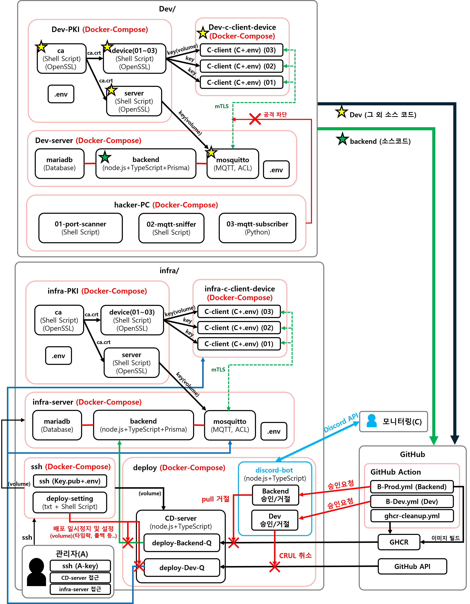

# 과거 기술 부채 청산 프로젝트
- 기간 : 2026.02.22 ~ 2026.03.16
과거 '저전력 스마트 표지판' 프로젝트의 보안 결함과 기술 부채를 청산하고,
위협 시나리오 기반 설계로 현대적인 IoT 보안 아키텍처를 구축한 1인 프로젝트입니다.

## 주요 기술 스택 선택 이유
- **C** - 저전력 IoT 단말 환경을 시뮬레이션하기 위해 시스템 자원을 직접 제어할 수 있는 C언어 쳬택
- **MQTT** - 과거 HTTP의 무거운 헤더로 인한 리소스 낭비 해결, TLS/SSL 적용 및 페이로드 암호화를 적용하기 위해 산업 표준인 경량 프로토콜 MQTT 사용
- **Docker** - 다수 VM(OS) 대신 커널을 공유하여 실행 속도가 빠르고 자원 점유율이 낮은 경량 인프라 구축 목적
- **Node.js** - 비동기 이벤트 기반 모델을 사용하여 다수 C클라이언트의 MQTT 데이터를 빠르게 처리할 수 있는 경량 서버 구축용
- **TypeSciprt** - 기존 자바스크립트의 타입 체크의 느슨함으로 발생할 수 있는 문제 완화 목적
- **Prisma ORM** - TypeScript 타입 안정성을 DB까지 확장하고, SQL 인젝션 구조적 방어 및 MariaDB 스키마 관리 목적
- **CI/CD (GitHub Action)** - 수동 배포의 번거로움 해결 및 코드 수정 시 빌드부터 배포까지 전 과정을 자동화하여 개발 속도를 극대화 및 SSH 사용 최소화
- **MariaDB** - MySQL 사용 경험을 계승하면서도 Docker 환경의 빠른 서비스 구축, C 클라이언트 데이터 보관 목적

## '저전력 스마트 표지판' 주요 결함 및 문제점
- **[부하]** IoT 환경에 부적합한 HTTP 통신 사용 (무거운 헤더로 인한 리소스 낭비)
- **[보안]** SSH 기본 포트(22) 방치 → Brute Force 공격에 취약
- **[보안]** DB 접속 정보 소스코드 내 평문 하드코딩 → 코드 유출 시 DB 탈취 위험
- **[보안]** SQL Injection 방어 로직 부재 → 악의적 구문 주입 및 데이터 파괴 위험
- **[보안]** 클라이언트-서버 간 평문(JSON) 전송 → 패킷 탈취 시 내용 노출

## 아키텍처 구조

## 프로젝트 결과
- **[위협 중심 설계]** 패킷 탈취 및 비인가 접속 등 핵심 공격 시나리오를 선제 정의 및 적용해보며, 이를 방어하는 인프라 아키텍처 설계
- **[신뢰 기반 통신]** 기존 평문 통신의 보안 취약점 문제 mTLS 도입으로 기기간 상호 인증 및 데이터 탈취 차단
- **[보안 인증 체계]** 비인가 접근과 기기 인증서 강탈을 방어하기 위해 PKI + ACL 적용, 비인가 접속 차단 및 피해 범위 최소화
- **[3중 보안 배포 체계]** 배포 승인/교차 검증을 통한 CI/CD 파이프라인 구축  및 배포 kill, 타임락 기반의 3단계 배포 보안 프로세스 확보 
- **[배포 효율성 최적화]** 기존 GHCR 배포 직렬 처리 구조를 병렬 처리로 전환하여, 시스템 유휴 대기 시간 제거.
- **[인프라 자립성 확보]** GitHub Actions 의존도 최소화를 위해 외부, 내부 워크플로우로 분리하여 공격 표면 최소화
- **[개발/운영 시뮬레이션]** Docker(+ compose) 기반의 DooD 구조에서 Dev, infra 환경 분리를 통한 호스트 시뮬레이션 환경 구축 
- **[환경별 배포 이원화]** 개발용, 운영용 배포 파이프라인을 독립 구축하여 목적에 따른 환경 격리 실현 